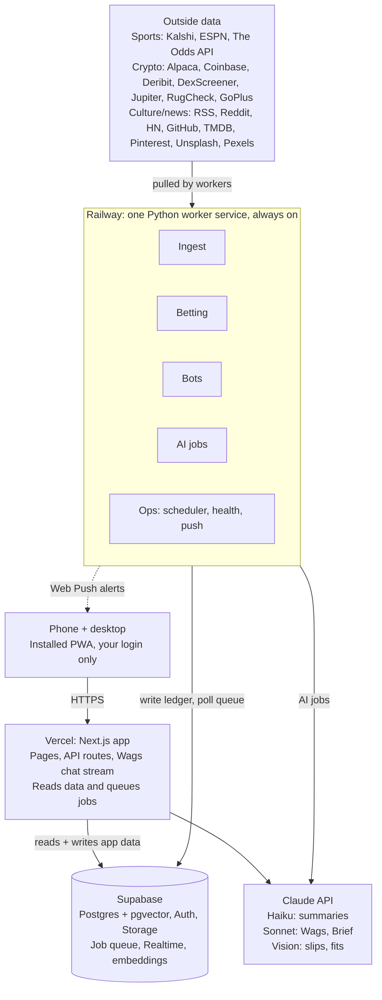
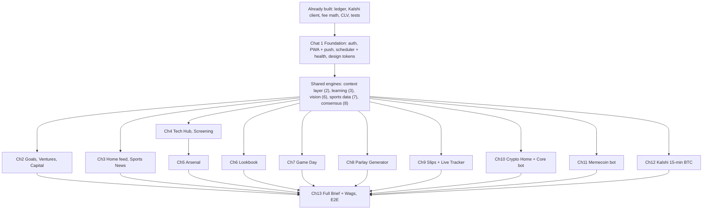

# Valemont Command — Master Plan

Oct 7, 2026 · @Terrell Sims

## Read first: six calls that shape everything

Verdict: build Valemont Command inside the existing valemont-agents repo, on free tiers except Railway Hobby and the Claude API (about $40–60/month total), and point the Betting pillar at a market-consensus engine instead of the old Kalshi models. The reasons follow.

**1. Your own repo already proved the Kalshi models don't beat Kalshi.** This is the most important finding of the audit. The `nfl_ml` walk-forward fit found no signal: its biggest possible adjustment was about 1.6¢ against the 3.1–4.3¢ a bet needs to clear fees. Both pre-registered props strategies failed their holdout, and by your own rule props stopped. Three outside builders measured the same thing and lost. Building the parlay generator on those models would print confident edges that don't exist.

**2. So the sharpest engine is market consensus, not a homemade model.** Each leg's probability starts from de-vigged sportsbook lines blended with the Kalshi mid. Edge = consensus probability − Kalshi price − Kalshi fee. That covers every sport Kalshi lists on day one, because any sport with sportsbook lines gets a number. Sport-specific models plug in later only after they pass a pre-registered holdout, the same discipline the repo already enforces. This is what practitioners running Kalshi bots actually do.

**3. Kalshi combos are quoted, not calculated.** There is no published leg cap. Each combo is priced live by market makers through a Request for Quote, eligibility turns on near game time, and coverage is mostly NFL and NBA. The generator therefore shows three prices per parlay: our correlated fair price, the naive product of leg prices, and a flag for whether every leg is combo-eligible. You pull the real quote in the Kalshi app. Ineligible slips are labeled "build manually."

**4. Kalshi needs no API keys to build any of this.** Market data is public and unauthenticated; the repo's client already reads it that way. Account verification only matters when you trade, and API keys only when you want quotes or orders pulled into the dashboard. Alabama has no state regulator action against Kalshi, but private class actions are pending there, so access risk sits in the risk register.

**5. The repo's "no real money, ever" rule must be amended before Chat 1.** CLAUDE.md §1 forbids any live execution. Your brief requires a paper/live switch on both bots. The amendment: paper by default; live only by an explicit owner flip per bot, with separate keys, hard limits and a kill switch. Kalshi bets and FOMO trades stay manual execution.

**6. Crypto venues.** Core bot runs on **Alpaca**: identical paper and live APIs, crypto paper trading open in every state, keys already stubbed in `.env.example`. Memecoin bot uses **FOMO** for execution, but FOMO has no official API. So the bot paper-trades on DexScreener and Jupiter prices, and in live mode it pushes you the call to execute in FOMO, then logs your fill.

## 1. Repo decision

Build on `valemont-agents` and turn it into a monorepo: `apps/web` (Next.js) and `workers/` (the existing Python). Don't start over. The repo is about 16,700 lines of Python with an immutable commitment ledger, Kalshi fee math, CLV tracking, a pre-registration system, a Railway deployment that's already proven, and a 360-test invariant suite. That is the hardest part of a betting and trading track record, and it's already done right.

| Existing piece | Decision | Why |
| --- | --- | --- |
| `core/` (ledger, BaseAgent loop, orchestrator) | Keep as-is | Commit-before-outcome ledger becomes the backbone for bets, bot trades and 15-min BTC calls |
| `venues/kalshi/` (read-only client, fees, edge gate) | Keep, extend | Add combo/multivariate reads, sport discovery across all series, optional authenticated RFQ later |
| `db/001–017` migrations | Keep, continue numbering at 018 (018 is the read-only inspection role; shared tables start at 019) | Paper/live separation and immutability triggers already exist for ledger tables |
| `sports/nfl/` models | Keep as research only | Failed holdout; kept registered as forward tests, not used for picks |
| `adapters/crypto.py` | Replace strategy, keep plumbing | Mechanical placeholder rule; core bot gets a real strategy on Alpaca |
| `adapters/prizepicks.py` | Fold into Manual Slip Entry | No public PrizePicks API; screenshot parsing replaces the fragile fetch |
| `adapters/equities.py` | Retire | Not in the brief |
| `chief_of_staff` (planned) | Becomes the data layer behind Wags and the Morning Brief | Read-only reporter, which is exactly what Wags needs |
| `tests/`, `tests_live/` | Keep and extend to every new worker | They already caught two silent data-loss bugs |
| `dashboard/` (empty) | Replaced by `apps/web` | Nothing to carry |

**Two architecture rules in CLAUDE.md change.** First, the "dashboard never reads Supabase directly" rule: the Next.js app now reads Supabase server-side with your login, through read-only views over the ledger. Workers stay the only writers to ledger tables. Second, the Supabase MCP: CLAUDE.md says the database is on a separate account with no MCP, so migrations stay paste-by-hand unless you decide to connect it. Recommendation: keep paste-by-hand for ledger migrations and allow the MCP for read-only inspection.

## 2. Architecture

Vercel shows it, Railway runs it, Supabase remembers it. Your phone never calls an outside API directly, and nothing long-running lives on Vercel.

- **Reads:** pages are server components that read Supabase with your session. API routes handle writes (reactions, goals, slips, uploads) and drop heavy work into the `job_queue` table.
- **Work:** the Railway worker runs the repo's existing APScheduler loop, polls the queue every few seconds, and writes results back to Supabase.
- **Live screens:** Live Bet Tracker, Game Day and BTC 15-min subscribe to Supabase Realtime, so the phone updates without refreshing.
- **Wags:** chat streams from a Vercel route that calls Claude with the latest cross-pillar context snapshot plus the page you opened it from.
- **Alerts:** the worker sends Web Push straight to your devices; no third-party notification service.

## 3. Data model

One Supabase Postgres database, `public` schema, migrations continuing at `db/019` (`db/018` is the `valemont_readonly` inspection role, Chat 1 Phase 1). The existing ledger tables stay the single source of truth for anything that wins or loses: generated parlays, played slips, bot trades and 15-minute BTC calls are all `commitments` with `legs` and `resolutions`. Everything else is ordinary app data.

**Paper vs live, from day one.** Every money table carries `mode text not null check (mode in ('paper','live'))` with default `'paper'`, alongside the existing `is_test`. Capital Tracker, model stats and bot stats always group by `mode`, so live money never mixes with paper numbers and flipping a bot to live needs no schema change.

**Row-level security.** App tables: RLS on, one policy `owner_id = auth.uid()` for select/insert/update/delete. Ledger tables: RLS on, a select-only policy for your user, no write policies. Workers write through the Postgres connection string, which bypasses RLS, so the frontend can read the ledger but can never edit a commitment. The immutability triggers from db/001–015 stay.

**Free-tier budget (500 MB).** Embeddings use 384 dimensions (about 1.5 KB per item). Unreacted news older than 90 days is pruned nightly; anything you reacted to is kept. Lookbook uploads are compressed to WebP in Storage (1 GB); Pinterest pins store URLs only. A nightly job logs table sizes and pushes an alert at 400 MB.

### Existing tables carried over

| Table | Role in Valemont Command |
| --- | --- |
| `agents`, `runs`, `events` | Every bot, generator and job is an agent; `events` feeds the activity stream |
| `commitments`, `legs`, `resolutions` | Parlays, played slips, bot trades, BTC 15-min calls. Gains `mode` and `origin` columns |
| `selections`, `commitment_factors`, `closing_snapshots` | Per-leg reasoning and CLV, already built |
| `resolution_attempts` | Void-rate health metric per agent |
| `kalshi_markets`, `kalshi_candles`, `kalshi_trades`, `kalshi_settlements` | Market archive; candles get a retention window to protect the 500 MB cap |
| `model_versions`, `preregistrations` | Any future sport model must pass through these before it's used for picks |
| `briefs` | Morning Brief storage |

### New tables

| Domain | Table | Key columns |
| --- | --- | --- |
| Shared | `app_settings` | owner\_id, timezone, notification prefs, seed interests (jsonb) |
| Shared | `push_subscriptions` | endpoint, p256dh, auth, device\_label |
| Shared | `notifications` | kind, title, body, deep\_link, sent\_at, status |
| Shared | `job_health` | job, last\_ok\_at, last\_error, consecutive\_failures |
| Shared | `ai_usage` | purpose, model, tokens\_in, tokens\_out, cost\_usd, created\_at |
| Learning engine | `sources` | pillar, name, kind (rss / reddit / github / api), url, weight, active |
| Learning engine | `content_items` | pillar, source\_id, external\_id, url, title, ai\_summary, published\_at, tags\[\], embedding vector(384); unique (source\_id, external\_id) |
| Learning engine | `reactions` | item\_id, reaction (love / neutral / not\_interested), created\_at |
| Learning engine | `interest_profiles` | pillar, profile\_vector, topic\_weights, source\_weights, updated\_at |
| Home | `goals` | title, horizon (weekly / long\_term), week\_start, status, carried\_from, completed\_at |
| Home | `calendar_cache` | event\_id, starts\_at, title (refreshed each morning) |
| Wags | `wags_threads` | title, origin\_page, created\_at |
| Wags | `wags_messages` | thread\_id, role, content, context\_refs (jsonb) |
| Wags | `context_snapshots` | built\_at, payload (jsonb summary of every pillar) |
| Ventures | `ventures` | name, stage, status, next\_action, blockers, archived\_at |
| Ventures | `venture_dates` | venture\_id, label, due\_on |
| Ventures | `venture_log` | venture\_id, entry, created\_at |
| Capital | `bankroll_entries` | mode, kind (deposit / withdrawal / adjustment), amount, note |
| Capital | `crypto_holdings` | mode, asset, qty, cost\_basis |
| Capital | `capital_snapshots` | date, mode, source, value (written nightly; history chart reads this) |
| Arsenal | `arsenal_refs` | category, title, origin, meaning, deploy\_line, room, source\_title\_id |
| Arsenal | `arsenal_drops` | date, ref\_ids\[\], power\_word, power\_word\_deploy\_line |
| Arsenal | `arsenal_saved` | ref\_id, saved\_at |
| Arsenal | `arsenal_quiz_attempts` | week\_start, ref\_id, correct |
| Screening | `titles` | tmdb\_id, kind (movie / tv), name, release\_date, providers (jsonb), trailer\_key, content\_item\_id |
| Screening | `watch_status` | title\_id, status (want / watching / finished), finished\_at |
| Lookbook | `lookbook_items` | origin (pinterest / upload / discovery), external\_id, image\_url, storage\_path, board, ai\_tags (jsonb), colors\[\], embedding |
| Lookbook | `lookbook_categories`, `lookbook_item_categories` | name, sort; item\_id, category\_id |
| Lookbook | `style_dna` | summary, palette, suggestions (jsonb), built\_at |
| Lookbook | `oauth_tokens` | provider, access\_token, refresh\_token, expires\_at (encrypted with pgsodium or app-side) |
| Tech Hub | `repos` | full\_name, stars, stars\_7d, topics\[\], why\_it\_matters, content\_item\_id |
| Sports | `sports_events` | league, espn\_id, kalshi\_event\_ticker, starts\_at, home, away, broadcast, status, score (jsonb) |
| Betting | `slips` | commitment\_id, origin (generated / analyzed / manual), venue, tier, stake, payout, mode |
| Betting | `slip_uploads` | storage\_path, parsed (jsonb), confirmed\_at, slip\_id |
| Betting | `leg_live_state` | leg\_id, current\_value, line, period, live\_prob, status (hit / on\_pace / danger / dead), updated\_at (latest row only) |
| Crypto | `bots` | kind (core / meme / btc15), mode, enabled, risk\_limits (jsonb), last\_heartbeat |
| Crypto | `bot_learnings` | bot\_id, insight, evidence (jsonb), created\_at |
| Crypto | `equity_snapshots` | bot\_id, mode, ts, equity |
| Crypto | `token_screens` | chain, mint, liquidity\_usd, rug\_flags (jsonb), passed, screened\_at |
| Crypto | `accumulation_signals` | asset, date, call (accumulate / hold / wait), reasoning, metrics (jsonb) |
| Crypto | `btc15_positions` | commitment\_id, entered\_price, entered\_at, exited\_price, exited\_at |

`job_queue` (kind, payload, status, attempts, run\_after) carries work the app hands to Railway: slip parsing, Arm Me requests, Lookbook tagging, on-demand parlay runs.

Views the app reads: `v_model_performance` (hit rate, ROI net of fees and CLV by tier, sport, mode), `v_capital_today` (totals and breakdown by source and mode), `v_open_exposure` (every open leg by game, never summed across agents).

## 4. API and services inventory

Expected spend is about **$40–60/month**: Railway Hobby (about $7–10) and the Claude API (about $30–50). Everything else runs on free tiers. Railway's permanent free plan gives $1/month of credit on 0.5 GB of RAM, which can't keep 24/7 workers alive, so Hobby is the one paid plan I'd insist on. The Claude API has no free tier, and a Claude Pro subscription doesn't cover API usage.

**How the Claude estimate is built.** Assumes about 300 summaries a day on the Haiku tier through the Batch API (about $5), Wags at about 20 messages a day on Sonnet 5.5 with prompt caching (about $14), and the Morning Brief, Arsenal, slip parsing, Lookbook tagging and bot reasoning together at about $15. Every call is logged to `ai_usage`, and a budget guard downgrades non-critical calls to Haiku if the month runs hot. Sonnet 5.5 lists at $2/$10 per million tokens and the Haiku tier at $1/$5 ([pricing](https://apidog.com/blog/claude-sonnet-5-5-pricing/)).

### Core platform

| Service | Used for | Tier and limits | $/mo | Account or key | Fallback |
| --- | --- | --- | --- | --- | --- |
| Vercel | Next.js app, API routes | Hobby, free (personal use) | 0 | Vercel account linked to GitHub | Cloudflare Pages |
| Supabase | Postgres, Auth, Storage, pgvector, Edge Functions | Free: 500 MB DB, 1 GB storage, pauses after 7 idle days (daily jobs prevent it) | 0 | Existing project; anon key, service role key, Session pooler URL | Pro at $25 if the cap is hit |
| Railway | All Python workers and the scheduler | Hobby: $5 including $5 usage ([pricing](https://temps.sh/blog/railway-pricing-2026)) | 7–10 | Existing account | Fly.io or Render |
| Claude API | Summaries, vision, Brief, Wags, Arsenal, reasoning | Pay as you go | 30–50 | Console API key with a monthly spend limit set | Haiku-only mode via budget guard |
| Embeddings | Learning engine, Lookbook similarity | Supabase built-in gte-small (384-dim) in Edge Functions, free | 0 | None | sentence-transformers on Railway |
| Web Push | All push alerts | Self-hosted VAPID with `web-push`, free | 0 | Generate VAPID keys once | Email digest |

### Betting and sports

| Service | Used for | Tier and limits | $/mo | Account or key | Fallback |
| --- | --- | --- | --- | --- | --- |
| Kalshi REST and WebSocket | Markets, prices, combo-eligible events, settlement | Public and unauthenticated for reads; limits undocumented, repo already backs off on 429 | 0 | None now; RSA API key later for RFQ quotes and your portfolio | Odds aggregators that carry Kalshi prices |
| ESPN site API (unofficial) | Schedules, live box scores, broadcasts, mainline odds | Free, no key, can change without notice | 0 | None | API-Sports free tier |
| The Odds API | Sportsbook lines for consensus on props and sports ESPN lacks | Free tier about 500 credits/month (approximate, verify at signup) | 0 | API key | Paid tier about $30 if consensus needs more coverage |
| nflreadpy, nba\_api, Fast-F1, pybaseball | Player and team stats for live probability and future models | Free libraries | 0 | None | ESPN stats |

### News, culture and tech

| Service | Used for | Tier and limits | $/mo | Account or key | Fallback |
| --- | --- | --- | --- | --- | --- |
| Publisher RSS | Home feed, Sports News, crypto news | Free; Bloomberg and The Information give headline and teaser only | 0 | None | Google News RSS query per source |
| Reddit API | r/ClaudeAI, r/OpenAI, r/LocalLLaMA | Free personal script app | 0 | Reddit app client id and secret | Subreddit `.rss` feeds, no key |
| Hacker News (Algolia) | Tech Hub | Free | 0 | None | HN Firebase API |
| GitHub REST | Trending and most-starred repos | 5,000 requests/hour with a token | 0 | Personal access token | Search sorted by recent stars |
| TMDB | Titles, release dates, trailers, where to stream | Free with attribution | 0 | API key | OMDb |
| Pinterest API v5 | Boards and pins sync | Free; trial access gives read scopes, but approval has taken weeks for many developers ([forum](https://community.pinterest.biz/t/update-developer-app-approvals/45527?page=4)) | 0 | Business account plus developer app | Public board RSS feeds |
| Unsplash, Pexels | Lookbook discovery feed | Free: about 50 and 200 requests/hour | 0 | API keys | Each other |
| Google Calendar | Morning Brief highlights | Free | 0 | Google Cloud OAuth client | Paste an ICS link |

### Crypto

| Service | Used for | Tier and limits | $/mo | Account or key | Fallback |
| --- | --- | --- | --- | --- | --- |
| Alpaca | Core bot paper and live execution, crypto data | Paper crypto open to every account in every region ([docs](https://alpaca.markets/learn/getting-started-with-alpaca-crypto-api)) | 0 | Separate paper and live key pairs | Coinbase Advanced |
| CoinGecko Demo | Long-term prices | Free, rate-limited | 0 | Demo key | Coinbase public candles |
| Coinbase public candles, Deribit DVOL | BTC spot proxy and volatility for the 15-min model | Free | 0 | None | Kraken public API |
| DexScreener | Memecoin pairs, liquidity, volume | Free, no key | 0 | None | Birdeye free tier |
| Jupiter | Meme price quotes for realistic paper fills | Free tier | 0 | Portal key | DexScreener price |
| RugCheck, GoPlus | Rug, honeypot and mint-authority checks | Free | 0 | None or free key | Each other |
| alternative.me, CoinMetrics community | Fear and Greed, cycle metrics for accumulation signals | Free | 0 | None | blockchain.com charts API |
| FOMO | Your manual memecoin execution | No official public API ([Bitquery note](https://docs.bitquery.io/docs/blockchain/Solana/fomo-api/)) | 0 | Your app account | Jupiter auto-execution if you ever want it |

## 5. Dependency map

Nothing gets built before what it stands on: Foundation first, then the five shared engines, each arriving one chat before the first pillar that needs it.

The one cross-pillar link to watch is Screening Room into the Arsenal: finished shows feed Arsenal cards, which is why Screening (Chat 4) lands before the Arsenal (Chat 5).

## 6. Build sequence

Thirteen build chats after this one, each split into phases with a test you run yourself. Frameworks come first (auth, push, scheduler, context layer, Morning Brief), so every later pillar plugs into Wags and the Brief the day it ships. The first version is done only when Chat 13's end-to-end test passes with all 16 pillars live.

**Every chat follows the same contract:** read this plan and CLAUDE.md, ask questions, search GitHub, deliver phased Claude Code prompts, list keys needed, and close with all checkboxes ticked. Every new worker also registers a Wags context provider and a Morning Brief section in the same chat.

### Chat 1 — Foundation

**Set up in this chat:** Supabase keys (existing project), Railway Hobby upgrade, Vercel account, Anthropic API key with a $60 monthly limit. VAPID push keys are generated locally, no account.

1. Repo restructure and rules: `apps/web` + `workers/`, CLAUDE.md amended (§1 live-money rule, §5 frontend reads).
   - [ ] Both test suites green after the move
   - [ ] Railway worker redeploys from the new path
2. Next.js app, Supabase Auth (your login only), design tokens extracted from your inspo screenshots.
   - [ ] Login works on phone and desktop; any other account is rejected
   - [ ] Tokens file drives every color, font and spacing value; no default shadcn grays
3. PWA shell and push: manifest, service worker (Serwist), VAPID keys, onboarding screen.
   - [ ] Installed to iPhone Home Screen; test push arrives with the phone locked
4. Shared tables (db/019; shifted from 018, which became the read-only role in Phase 1), consolidated worker scheduler, `job_health`, `ai_usage`, budget guard.
   - [ ] A deliberately failing test job triggers a push after two misses

### Chat 2 — Command core

**Set up in this chat:** Google Cloud project with the Calendar API and an OAuth client.

1. Goals (weekly and long-term, Monday reset, carry-over, history).
   - [ ] Unfinished goals carry to the next week automatically
2. Ventures HQ (all nine ventures seeded, detail view, running log, dates).
   - [ ] A venture item due today appears in the Today list
3. Capital Tracker on paper data, labeled PAPER, with history chart.
   - [ ] A paper bankroll entry shows in the total and the breakdown within a minute
4. Context layer and Wags: page-aware floating button, saved threads, provider registry.
   - [ ] Wags answers "what's due this week" from real venture and goal data
5. Morning Brief generator on Railway, sections that switch on as pillars register.
   - [ ] A brief generates at the scheduled time and arrives as a push

### Chat 3 — Learning engine, Home feed, Sports News

**Set up in this chat:** nothing new; RSS needs no keys.

1. Source registry, RSS ingest, dedupe, Haiku batch summaries, embeddings.
   - [ ] All 13 seed sources ingest; every item shows a summary and the original link
2. Love / Neutral / Not Interested, interest profile, daily re-rank, seeded interests.
   - [ ] Ten Not Interested taps on one topic visibly push it down the next day
3. Sports News for CFB, NFL, NBA, F1 and Golf on the same engine.
   - [ ] Filter chips by sport; reactions train the sports profile separately

### Chat 4 — Tech Hub and Screening Room

**Set up in this chat:** Reddit script app, GitHub fine-grained token (public read only), TMDB API key.

1. Tech Hub: official changelogs, Hacker News, the three subreddits, GitHub trending with a "why this matters to you" line.
   - [ ] A new Claude or OpenAI release shows up within one ingest cycle
2. Screening Room: TMDB search, watchlist, currently watching, release dates, trailers, where to stream.
   - [ ] Recommendations reflect the six seed shows on day one and shift after reactions

### Chat 5 — The Arsenal

**Set up in this chat:** nothing new.

1. Daily drop (2–3 references, rotating categories) and Power Word of the Day.
   - [ ] Each card has origin, meaning, a deploy line and the room it plays in
2. Arm Me box, My Arsenal saves, weekly quiz.
   - [ ] Arm Me returns three references for a typed situation in under 10 seconds
3. Screening Room hook: marking a show finished drafts its references into the Arsenal.
   - [ ] Finishing a show produces new Arsenal cards tagged to it

### Chat 6 — The Lookbook and the vision service

**Set up in this chat:** Pinterest app credentials (applied for before Chat 1), Unsplash and Pexels keys.

1. Shared vision service: image in, structured JSON out, confidence per field.
   - [ ] The same service tags an outfit photo and reads a test slip screenshot
2. Pinterest: OAuth sync if approved, public board RSS fallback otherwise.
   - [ ] Your boards appear organized by board within one sync
3. Uploads from the share sheet and camera roll, custom categories, auto-tagging.
   - [ ] A photo shared from Instagram lands in the Lookbook tagged and categorized
4. Discovery feed (Unsplash and Pexels) with learning; Style DNA with fit and IG suggestions.
   - [ ] Style DNA summary updates after new saves

### Chat 7 — Sports data layer and Game Day

**Set up in this chat:** nothing new; ESPN needs no key. API-Sports free key only if the fallback is needed.

1. ESPN adapter with schema checks, API-Sports fallback, `sports_events`, mapping to Kalshi event tickers.
   - [ ] Tonight's games across your five sports show times, channels and matchups
   - [ ] Every NFL and NBA game links to its Kalshi event
2. Game Day page and tonight's slate in the Morning Brief.
   - [ ] Tapping a game opens its detail page (bets attach in Chat 9)

### Chat 8 — Betting: consensus engine and Parlay Generator

**Set up in this chat:** The Odds API free key. Kalshi needs none.

1. Kalshi discovery across every sport series, combo eligibility, fee schedule.
   - [ ] Daily list of every open Kalshi sports market, grouped by sport, with fees
2. Consensus engine: de-vigged sportsbook lines blended with the Kalshi mid; edge net of fees.
   - [ ] Each leg shows model probability, Kalshi price, fee and net edge
3. Correlation model for same-game legs (historical joint outcomes, Gaussian copula fallback).
   - [ ] A QB-passing-yards plus team-win pair prices above the naive product
4. Generator: Safer (3–5), Mid (6–10), Lotto (11–20); one-line reason per leg; every parlay committed to the ledger before games start.
   - [ ] Daily parlays generated on schedule; each tier tracked separately by sport

### Chat 9 — Slip Analyzer, Manual Entry, Live Bet Tracker

**Set up in this chat:** nothing new.

1. Slip Analyzer: screenshot in, legs run through the engine, weakest legs and swaps out.
   - [ ] A real Twitter parlay screenshot parses and returns per-leg probabilities
2. Manual Entry (PrizePicks and others) with confirm/edit, and the "I'm playing this" button.
   - [ ] Any slip becomes a tracked bet with stake and payout
3. Live Bet Tracker: stat vs line, leg status, live probability, push on hit and danger.
   - [ ] During a live game, a leg moves from on pace to hit with a push alert
4. Settlement: P/L history, model performance, Capital Tracker feed.
   - [ ] A settled slip shows in history and moves the paper bankroll

### Chat 10 — Crypto Long-Term Home and Core Paper Bot

**Set up in this chat:** Alpaca account and paper key pair (instant), CoinGecko Demo key.

1. Long-Term Home: live prices, accumulation signals with reasoning, news strip.
   - [ ] BTC, ETH, SOL and XRP each show accumulate, hold or wait with a reason
2. Core bot on Alpaca paper: strategy, risk limits, on/off toggle, trade reasoning, learnings log.
   - [ ] The toggle stops the bot within one cycle; every trade shows its reasoning
3. Live switch: separate keys, typed confirmation, daily loss limit, kill switch.
   - [ ] A live-mode dry run is refused without live keys present

### Chat 11 — Memecoin Paper Bot

**Set up in this chat:** Jupiter developer key; GoPlus free key if RugCheck alone isn't enough.

1. DexScreener discovery, RugCheck and GoPlus screens, liquidity floor.
   - [ ] A known honeypot token is rejected with the reason logged
2. Paper trading on Jupiter quotes with slippage; same stats and learnings as the core bot.
   - [ ] Equity curve, win rate and drawdown render from real paper trades
3. Live mode as FOMO signals: push with the token and size, you execute, you log the fill.
   - [ ] A signal push opens a pre-filled fill log

### Chat 12 — Kalshi 15-Min BTC

**Set up in this chat:** nothing new; Kalshi and Coinbase market data are public.

1. Live BTC price, current `KXBTC15M` market, model call with confidence per window, committed before the window opens.
   - [ ] A call appears for every window and is locked before it starts
2. Entered and Exit logging, profit-only exit alerts, accuracy dashboard.
   - [ ] An exit alert fires only when the position is in profit

### Chat 13 — Integration, hardening, launch

**Set up in this chat:** only if you choose to go live: Alpaca live keys, Kalshi verification and an RSA API key for in-app combo quotes.

1. Morning Brief with every section live; Wags tested on cross-pillar questions.
   - [ ] The brief reads in under a minute and every section has real data
2. Capital Tracker wiring audit across bets and bots, paper and live.
3. Full end-to-end test (section 8), fixes, and the go-live checklist.
   - [ ] Every box in section 8's end-to-end test is ticked

## 7. Risk register

The three most likely ways this build fails are silent worker death, data sources changing shape, and the betting pillar showing edges that aren't real. Each has a mitigation built into the plan, not bolted on later.

| Risk | Likelihood | Mitigation built into the plan |
| --- | --- | --- |
| Betting shows edges that don't exist | High without guardrails | Consensus engine, fees inside every edge, CLV and ROI tracked net of fees per tier and sport, no sport model used until it passes a pre-registered holdout |
| Kalshi sports access changes in Alabama | Medium | No state regulator action yet, but class actions are pending and two federal appeals courts ruled against Kalshi in 2026 ([status](https://wsn.com/prediction-markets/legal)). Venue adapter is pluggable so Polymarket US or a sportsbook can be added without touching the generator |
| Kalshi combo rules or pricing change | Medium | Combo eligibility read live from the API every run; leg cap never hard-coded; RFQ quote treated as the only real combo price |
| Kalshi market list flooded by auto-generated combo markets | Already happening | Read through the events tree and `/events/multivariate`, never the raw open-markets list ([note](https://apify.com/scrapebench/kalshi-polymarket-prediction-market-scraper)) |
| Kalshi API field or endpoint changes | Medium | Repo's fail-loud client plus a daily contract test against live response shapes; changelog checked each build chat |
| ESPN unofficial endpoints change or block | Medium | One `espn` adapter module, schema-validated responses, `job_health` alert on first failure, API-Sports fallback wired in Chat 7 |
| Live stats latency (30–90 s behind TV) | Certain | Leg status shows its data timestamp; danger alerts debounced; no live-betting suggestions built on stale stats |
| The Odds API free credits run out | High during NFL season | ESPN odds for mainlines, Odds API only for props, cached per slate, credit counter on the dashboard |
| Pinterest trial access stuck pending for weeks | High | Apply during environment setup; Lookbook ships on public board RSS feeds plus uploads, then switches to OAuth sync when approved |
| Supabase 500 MB cap | Medium within 6 months | Retention jobs, 384-dim embeddings, candle archive windowed, size alert at 400 MB |
| Supabase project pauses | Low | Daily worker writes count as activity |
| Worker dies silently at 3 a.m. | High without monitoring | Heartbeat per bot and job, `job_health` table, push alert after two missed runs, Railway restart policy, SIGTERM drain already in repo |
| Railway usage creeps past $5 credit | Medium | One consolidated worker service with an internal scheduler instead of many services; usage alert set in Railway |
| Vercel function time limits on Hobby | Medium | Nothing long-running on Vercel: AI generation, parsing and syncing happen on Railway, Vercel only reads and enqueues |
| Claude API cost spike | Low | Spend limit in the Anthropic console, `ai_usage` logging, budget guard, Batch API for summaries |
| Claude vision misreads a slip | Medium | Every parsed slip goes to a confirm/edit screen before it's saved; parse confidence shown per leg |
| Memecoin rug or honeypot | High in that market | Two independent checks (RugCheck and GoPlus) plus a liquidity floor before any paper entry; a failed check blocks entry |
| Paper fills too optimistic | High | Fills priced off real quotes with spread and slippage added; meme fills use Jupiter quotes for the actual size |
| Accidental live trade | Low, severe | Live keys only in a separate Railway environment, per-bot live flag requires typed confirmation, hard daily loss limit and kill switch |
| iPhone PWA push quirks | Medium | Push works only from the Home Screen app on iOS 16.4+; onboarding screen walks through Add to Home Screen; permission requested from a button tap |
| iOS evicts PWA storage | Medium | Nothing important stored on device; everything lives in Supabase |
| Windows PowerShell gotchas | Certain | Every command written for PowerShell (`$env:` not `export`, `;` not `&&` on 5.1, `python -m` everywhere); Python 3.12 via the official installer; repo's Dockerfile builds on Railway, not locally |
| Scope size (16 pillars, no MVP) | Certain | Dependency-ordered chats so finished pillars are usable daily while later ones are built; nothing deferred |

## 8. Testing plan

A pillar is done when three layers pass: automated tests, a live check on real data, and your phone test from the chat's checklist. Nothing moves forward on a claim made in a chat transcript; if it isn't in a test or on your screen, it isn't verified.

| Layer | What it covers | How it runs |
| --- | --- | --- |
| Invariant suite (`tests/`) | Ledger rules, fees, edge math, risk limits, correlation math, paper/live separation | `python -m unittest discover -s tests -t .` before and after every worker change |
| Live database suite (`tests_live/`) | Migrations, triggers, RLS policies, views | Same command on `tests_live`, after each migration is pasted |
| Contract tests | Real response shapes from Kalshi, ESPN, TMDB, Pinterest, DexScreener, Alpaca | Daily on Railway; a shape change alerts instead of silently returning nulls |
| Web tests | Pages render, auth blocks strangers, reactions save | Playwright smoke run against the Vercel preview on each push |
| Accuracy tracking | Parlay hit rate, ROI net of fees and CLV by tier and sport; bot P/L and drawdown; 15-min call accuracy | Dashboards built in the pillar's own chat, reported per agent, never blended |
| Phone check | One-handed use, push arrival, Home Screen install | Your checklist at the end of every phase |

### End-to-end test before calling the build done (Chat 13)

- [ ] Morning Brief arrives by push, opens in the PWA and every section has today's data
- [ ] Love three articles; the next day's feed ranks similar items higher
- [ ] Generate parlays, play one on paper, watch it in the Live Tracker, settle it, and see it in model stats and Capital Tracker
- [ ] Upload a slip screenshot from your camera roll; it parses, you confirm it, it tracks live
- [ ] Core and meme bots run 72 hours unattended with heartbeats green and no missed jobs
- [ ] A 15-min BTC call is logged before its window; an exit alert fires in profit only
- [ ] Share an Instagram image to the Lookbook; it's tagged and categorized
- [ ] Ask Wags "what should I focus on today" and "how's the model doing this month"; both answers cite real data
- [ ] Kill a worker on purpose; you get a push within two missed cycles
- [ ] Log out; no page or API route returns your data

## 9. Environment setup checklist

Only three things happen before Chat 1. Every other account and key is set up inside the chat that first needs it (see "Set up in this chat" under each chat in section 6), and that chat's first prompt walks you through it.

**Start now: the only slow clock**

- [ ] Pinterest: convert to a free business account, create a developer app, request trial access with read scopes (`boards:read`, `pins:read`, `user_accounts:read`), described as a personal tool reading your own boards. Approval can take weeks, so starting now means it's through by Chat 6
- [ ] Make your Lookbook Pinterest boards public, so the RSS fallback works if approval is still pending

**Machine (PowerShell)**

- [x] Node 20 LTS or newer: `node -v`
- [x] Python 3.12 in the repo venv (matches the Dockerfile): `.\venv\Scripts\python.exe --version`
- [x] Git and the GitHub CLI: `git --version`; `gh auth status`
- [x] pnpm, Railway CLI, Vercel CLI: `npm install -g pnpm @railway/cli vercel`
- [x] Green baseline in the repo: `.\venv\Scripts\python.exe -m unittest discover -s tests -t .`

**Cursor**

- [ ] GitHub, Context7, Memory and Supabase MCPs connected; Supabase MCP set to read-only
- [ ] This plan saved as `docs/MASTER_PLAN.md` and the build brief as `docs/BUILD_BRIEF.md`
- [ ] 5–10 design inspo screenshots ready for Chat 1

## 10. What needs your approval

Approved by Tsims on Oct 7, 2026: all six decisions below are locked. Chat 1 starts from this plan.

- [x] Build on `valemont-agents` as a monorepo (section 1)
- [x] Betting runs on the market-consensus engine; the old NFL models stay research-only until a new model passes a pre-registered holdout (Read first, points 1–2)
- [x] Amend CLAUDE.md: paper by default, live only by an explicit per-bot flip with separate keys and hard limits (point 5)
- [x] Alpaca for the core bot; memecoin live mode as FOMO signals you execute by hand (point 6)
- [x] Pay for Railway Hobby and the Claude API (about $40–60/month); everything else free (section 4)
- [x] Thirteen-chat sequence with Wags and the Morning Brief framework built in Chat 2 (section 6)
